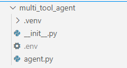
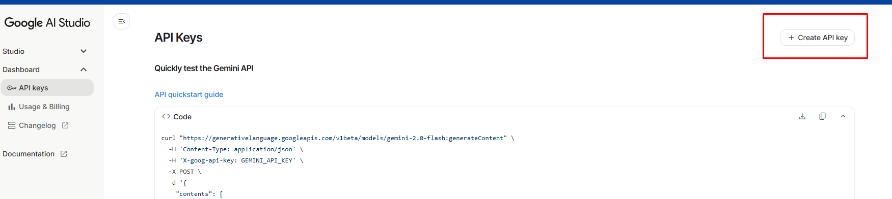
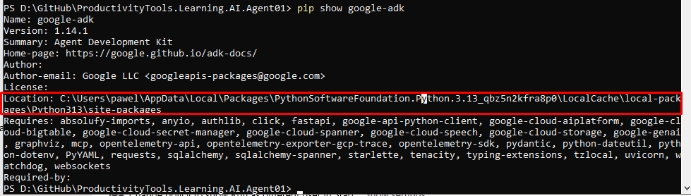

# Agent Development Kit

Google created simple [tutorial](https://google.github.io/adk-docs/get-started/quickstart/) how to create first agent.


```
python -m venv .venv
pip install google-adk
mkdir multi_tool_agent/
notepad __init__.py
```
```
from . import agent
```
```
notepad agent.py
```
```
import datetime
from zoneinfo import ZoneInfo
from google.adk.agents import Agent

def get_weather(city: str) -> dict:
    """Retrieves the current weather report for a specified city.

    Args:
        city (str): The name of the city for which to retrieve the weather report.

    Returns:
        dict: status and result or error msg.
    """
    if city.lower() == "new york":
        return {
            "status": "success",
            "report": (
                "The weather in New York is sunny with a temperature of 25 degrees"
                " Celsius (77 degrees Fahrenheit)."
            ),
        }
    else:
        return {
            "status": "error",
            "error_message": f"Weather information for '{city}' is not available.",
        }


def get_current_time(city: str) -> dict:
    """Returns the current time in a specified city.

    Args:
        city (str): The name of the city for which to retrieve the current time.

    Returns:
        dict: status and result or error msg.
    """

    if city.lower() == "new york":
        tz_identifier = "America/New_York"
    else:
        return {
            "status": "error",
            "error_message": (
                f"Sorry, I don't have timezone information for {city}."
            ),
        }

    tz = ZoneInfo(tz_identifier)
    now = datetime.datetime.now(tz)
    report = (
        f'The current time in {city} is {now.strftime("%Y-%m-%d %H:%M:%S %Z%z")}'
    )
    return {"status": "success", "report": report}


root_agent = Agent(
    name="weather_time_agent",
    model="gemini-2.0-flash",
    description=(
        "Agent to answer questions about the time and weather in a city."
    ),
    instruction=(
        "You are a helpful agent who can answer user questions about the time and weather in a city."
    ),
    tools=[get_weather, get_current_time],
)
```
```
notepad .env
```
```
GOOGLE_GENAI_USE_VERTEXAI=FALSE
GOOGLE_API_KEY=PASTE_YOUR_ACTUAL_API_KEY_HERE
```




## API Key from Google AI Studio



## Run agent
```
pip show google-adk
```



```
go to the parent directory of multi_tool_agent
cd multi_tool_agent
cd ..

C:\Users\pawel\AppData\Local\Packages\PythonSoftwareFoundation.Python.3.13_qbz5n2kfra8p0\LocalCache\local-packages\Python313\Scripts\adk.exe web
```